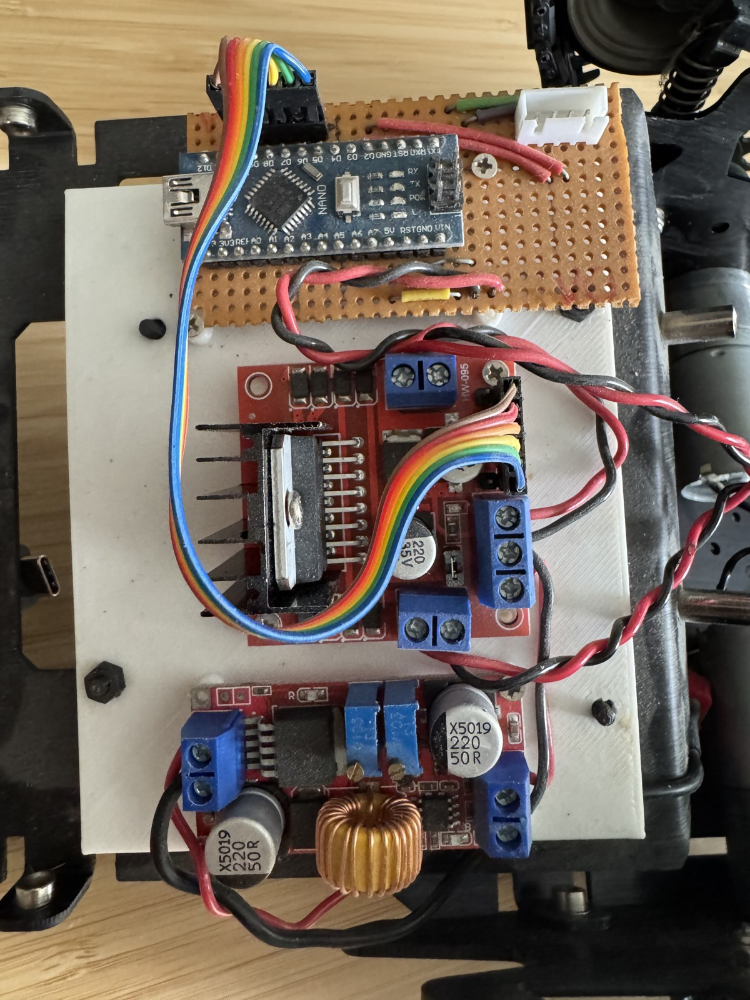
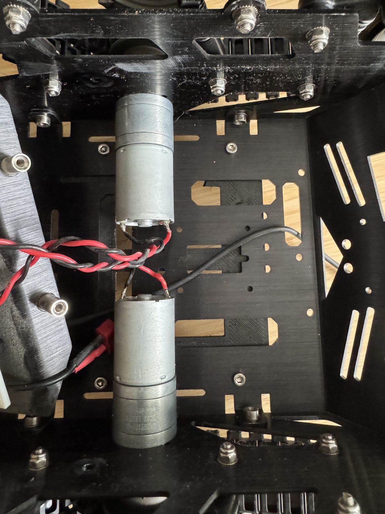

# Hardware

The chassis as purchased, and the electronics as found on the part-built robot.

> **This is not a bill of materials for the new robot.** Everything under
> [as-found](#as-found-inventory) is the *previous* build. What replaces it is being
> decided in [`open-questions.md`](open-questions.md); what still needs buying is in
> [`sourcing.md`](sourcing.md).

## The chassis

**DFRobot Devastator Tank Mobile Robot Platform**, metal DC gear motor variant.

| | |
|---|---|
| Part number | DFRobot **ROB0128** |
| UK supplier | [The Pi Hut](https://thepihut.com/products/devastator-tank-mobile-robot-platform-metal-dc-gear-motor) — **£81.60 inc VAT** (checked 2026-09-07) |
| Dimensions | **225 × 220 × 108 mm** (L × W × H) |
| Mass | **1.3 kg** |
| Rated payload | **3 kg** |
| Construction | Aluminium plates, drilled with a dense mounting-hole pattern |
| Drive | 2 × brushed DC metal gearmotors, skid-steer through tracks |
| **Between side frames** | **134 mm** (measured 2026-09-07) — the hard limit on a facing pair of motors |

### The original motors

| | |
|---|---|
| Gear ratio | **45:1** |
| Rated voltage | **6 V** (operating range **2–7.5 V**) |
| No-load speed | **133 RPM @ 6 V** |
| No-load current | 0.13 A |
| Stall torque | **4.5 kg·cm** |
| Stall current | **2.3 A** |
| Output shaft | **4 mm D** |
| Motor + gearbox | **25 mm OD × 52 mm** — the commodity **25D / 25GA** envelope |
| Face mounting | **2 × M3 at 17 mm centres** |
| Encoders | **None.** Not part of this SKU — confirmed from the hardware, not only the listing |

All four dimensions and the 6 V / 133 RPM gearbox marking were **measured 2026-09-07**
([`test-log.md`](test-log.md)); the electrical ratings above remain vendor figures.

**The 6 V rating is the single most consequential fact about this platform.** The family
standard is a 12 V rail from a 3S pack
([common.md](https://github.com/WayneKennedy/wk-robotics/blob/main/docs/common.md#actuators));
a **2S LiPo alone peaks at 8.4 V**, already above the 7.5 V ceiling. These motors cannot
be fed directly from any pack the rest of the family uses. They are replaced — DEC-11.

## As-found inventory

**Photographed and identified 2026-09-07.** The robot was left part-built; the following
is what is physically fitted. None of it is a design commitment.

| Fitted | Detail |
|---|---|
| **Arduino Nano** (ATmega328P) | Mounted on stripboard; 6-way ribbon to the driver — IN1–IN4 plus the two enables |
| **L298N** dual H-bridge module | Heatsink, onboard 5 V regulator, screw terminals |
| **Adjustable DC-DC converter module** | Toroidal inductor, two trimpots (so constant-voltage *and* constant-current adjustment). **Part number unidentified**; rating and set-point unknown — measure before trusting it |
| White plate carrying the stack | **Printed or laser-cut — not established which** |
| 4-way JST connector on the stripboard | **Purpose unknown** |

Both gearmotors are mounted and wired, twisted pairs soldered directly to the tabs —
tidy work. The rear shafts are bare, confirming the no-encoder SKU.

**Not visible in the photographs, and therefore still unknown:** the battery and its
connector, and whether motor suppression capacitors are fitted.

**Also fitted at the time of the original build, per the owner's account** (not visible
in these photographs): a **Raspberry Pi 4** and **two Intel RealSense cameras** on top.
Which camera models is **unrecorded** — the hexapod now runs a D435i, and whether that
is one of these two is **not established**.

## Two fitted parts are dead ends

Both are cheap to replace, and both are recorded here so the reason is not lost.

- **The L298N is the part the family explicitly rejected** — *"avoid L298N (lossy BJT,
  ~2 V drop)"*, `koala-bot/docs/sourcing.md`. On a **6 V** motor that drop costs a third
  of the rail; on koala-bot's 12 V it would cost a sixth. It is a
  [plausible but unconfirmed](concept.md#the-first-build-and-why-it-stopped) contributor
  to the original build disappointing.
- **The Arduino Nano cannot run micro-ROS.** It is an 8-bit AVR;
  [micro-ROS requires a 32-bit target](https://github.com/WayneKennedy/wk-robotics/blob/main/docs/common.md#micro-ros-how-the-mcu-joins-the-graph).
  Joining the topic contract means replacing it.

## Constraints on any motor swap — resolved 2026-09-07

Measured, not assumed. The swap itself is **DEC-11**.

- **The motor bracket takes 2 × M3 at 17 mm centres**, which the Pololu 25D face plate
  matches exactly. No modification needed.
- **koala-bot's 37D motors are ruled out** — 37 mm body, 25 mm envelope. Confirmed, where
  this previously read "likely too large — unverified".
- **Length is the binding constraint, not diameter.** Two motors face each other across
  **134 mm**, so a facing pair must total less than that. The original pair uses 104 mm;
  anything with a rear-mounted encoder is close to the limit.
- **The shaft/hub interface clears.** The side plates carry a **clearance hole for the
  motor hub**, so the boss and shaft pass through it and the motor face seats flush on the
  plate. Nothing bottoms out, and the 12.5 mm the Pololu shaft stands proud is not
  consumed by the plate. Confirmed by inspection 2026-09-07 ([`test-log.md`](test-log.md)).
