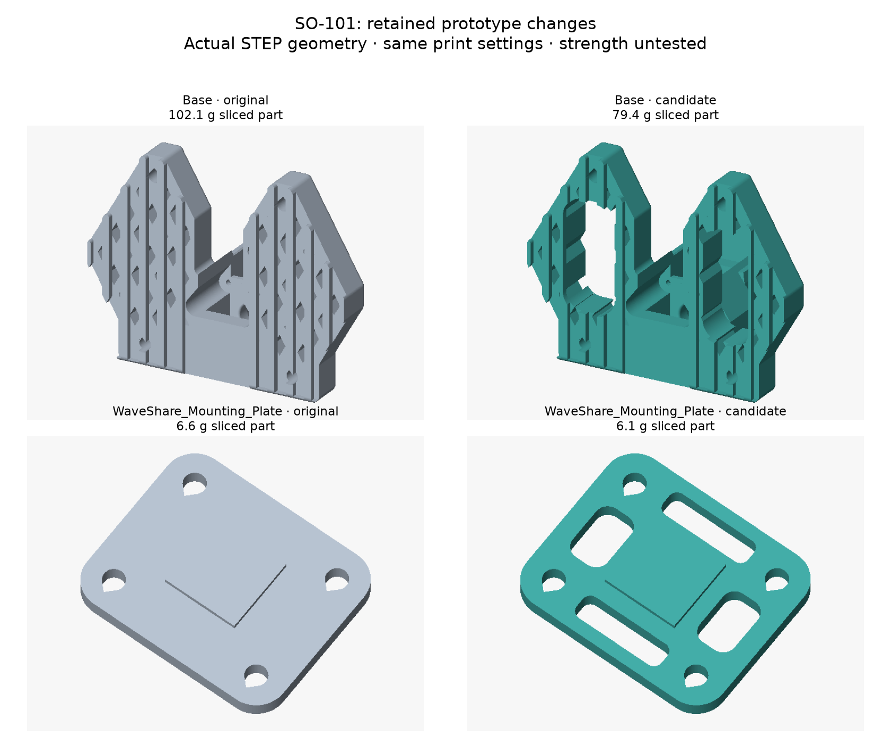

# SO-101 lightweight study — v1 prototype

**2026-09-21. Eleven follower STEP files, two modified parts.** The retained changes
save **23.2 g of sliced plastic (6.1%)** under the comparison settings. They do not
establish the proposed 50% reduction or unchanged mechanical performance. The base
and board plate are unprinted prototypes; the nine moving/servo-bearing parts in
this set are byte-identical to upstream STEP files.

- [Detailed investigation and conclusion](report.md)
- [STEP set](step/) — one of each file; millimetres; original CAD coordinates
- [Print-oriented STL set](stl/) — one of each file; millimetres; placed on Z = 0
- [Per-part mass comparison](analysis/mass-p3.csv)
- [Geometry, source hashes and interface checks](analysis/geometry.json)
- [Printing and validation requirements](report.md#printing-and-physical-validation)



## What changed

| File | Change |
|---|---|
| `Base_SO101.step` | Two rounded through-windows in the mounting wings. Servo pocket, central support, bolt regions, foot and outside dimensions retained |
| `WaveShare_Mounting_Plate_SO101.step` | Four rounded openings; centre attachment and four screw regions retained |
| Other nine STEP files | Exact copies of the pinned upstream originals |

Joint centres, link lengths, servo pockets, horn geometry, fasteners and gripping
surfaces remain upstream's. Window interiors are new geometry. Clamps must bear
on retained solid lands, not span an opening. The base's modified load path still
needs testing. The changes reduce stationary mass; **they do not reduce shoulder
gravity torque or increase the arm's payload**.

## Reproduce

Use Python 3.12, the pinned dependencies, a runnable PrusaSlicer **2.7.2** CLI and
the upstream clone at commit `eecbe3e0a9ebb23e25ad7b2759b03884c6660903`.
`source-lock.json` rejects different input STEP/STL bytes. The upstream clone is
read-only; all generated outputs belong here or in an explicitly chosen directory.

From this directory, with the sibling layout described in the project onboarding:

```bash
uv venv /tmp/so101-cad-venv
uv pip install --python /tmp/so101-cad-venv/bin/python -r requirements.txt
/tmp/so101-cad-venv/bin/python generate.py --upstream ../../../../../SO-ARM100
/tmp/so101-cad-venv/bin/python compare_slices.py --upstream ../../../../../SO-ARM100 --slicer /path/to/prusa-slicer
/tmp/so101-cad-venv/bin/python compare_slices.py --upstream ../../../../../SO-ARM100 --slicer /path/to/prusa-slicer --perimeters 2 --work /tmp/so101-slicing-p2
/tmp/so101-cad-venv/bin/python analyse_loads.py --upstream ../../../../../SO-ARM100
/tmp/so101-cad-venv/bin/python render_comparison.py --upstream ../../../../../SO-ARM100
```

`analyse_loads.py` additionally needs the project's existing `software/kinematics.py`
and calibration JSON; it performs offline calculations only. `comparison.ini` is
for material accounting, **not a production printer profile**. The scripts never
connect to a printer or servo. Do not print the temporary analysis G-code.

`generate.py --experimental-links --output /tmp/so101-rejected` reconstructs the
rejected moving-link window geometry for further investigation. It is deliberately
excluded from `step/`. Its archived first-iteration measurements are under
[`analysis/rejected-link-windows/`](analysis/rejected-link-windows/); that run used
the earlier relative-deflection mesh export and its recorded orientations, so its
toolpaths are not byte-reproduced by the improved release mesh exporter.
`analyse_sections.py --cad-dir /tmp/so101-rejected --upstream UPSTREAM_PATH`
repeats the section screen; `compare_slices.py` accepts the same `--cad-dir`
option for a new slice comparison.

## Provenance and licences

Geometry: [TheRobotStudio/SO-ARM100](https://github.com/TheRobotStudio/SO-ARM100/tree/eecbe3e0a9ebb23e25ad7b2759b03884c6660903),
**Apache-2.0**, including local modifications. See [LICENSE](LICENSE) and
[NOTICE](NOTICE). Generator/analysis/rendering code: **MIT**, under the project's
software licence. This README, report and figures: **CC-BY-SA-4.0**, under the
project's documentation licence. The comparison configuration is **CC0-1.0**.
