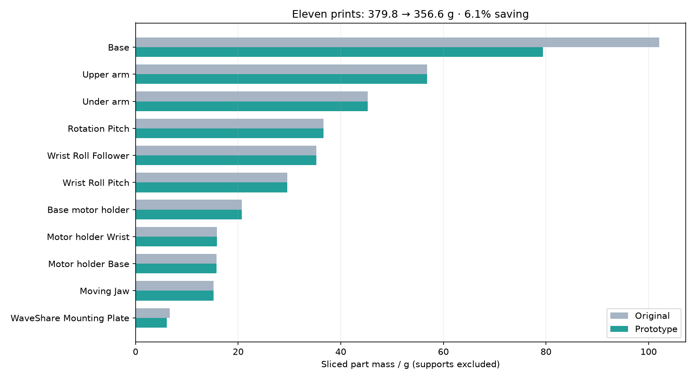

# Is the SO-101 unnecessarily heavy?

**Investigation date: 2026-09-21. Status: computational study; no new parts printed
or mechanically tested.** Scope: this build's six 12 V servos and eleven PLA+
follower parts. The owner proposed halving the printed mass without mechanical
weakness, then clarified that no particular payload was required: the concern was
the arm's apparent bulk. Payload examples below are assessment cases, not selected
requirements or new ratings.

## Finding

**The 50% claim is not established.** There is removable material, especially in
the stationary mounting base. However, this arm already uses sparse infill, and
the long links' large outside dimensions help resist bending and twisting.
Appearance and solid CAD volume substantially overstate the readily removable
*printed* mass.

The supplied [eleven-part STEP set](step/) retains two changes: base windows and
board-plate windows. At matched settings they save **23.2 g**, or **6.1% of the
sliced print mass**. If that differential carries over to this physical build,
its measured 810 g would become approximately **787 g**. This is a prediction,
not a second weighing. All moving-link STEP files remain upstream originals.

The retained changes remove stationary mass, so **they do not improve servo
payload, shoulder gravity torque or moving inertia**. They could modestly help a
mobile platform carrying the entire arm. I would not reprint the complete arm
for this saving; testing only the modified base is the useful next experiment.

This limited result does **not** prove that no major redesign could halve plastic
mass. Such a redesign would need an explicit stiffness/duty requirement and
different load paths, followed by validation. This study does not deliver or
claim a mechanically equivalent 50%-lighter arm.

## Establishing the mass baseline

The [2026-09-17 weighing](../../docs/test-log.md#2026-09-17--the-assembled-arm-weighs-810-g--oq-04-answered)
was **810 g**, fully assembled with the bus driver, without external connections;
the instrument was not recorded. Subtracting nominal servo mass leaves a
**non-servo remainder**, not a measurement of plastic alone. It includes the
driver, fasteners, horns/accessories insofar as excluded from servo specifications,
internal wiring and any discrepancy between nominal and actual servo mass.

The existing prints are eSUN PLA+, with recorded settings of three perimeters,
0.2 mm layers, four top/bottom layers and 15% grid infill. Historical print results
are in the private [printing records](https://github.com/WayneKennedy/3d-printing/blob/main/docs/print-log.md);
no machine access details are needed for this study. Those records include
supports/brims and discarded attempts, so summing every job would overcount the
assembled plastic.

| Quantity | Value | Evidence / meaning |
|---|---:|---|
| Assembled arm | 810 g | Owner's weighing |
| Six nominal servos | 330 g | Calculation from the [family's manufacturer specification](../../../../docs/common.md#sts3215-torque-and-mass) |
| Non-servo remainder | 480 g | Subtraction; **not plastic mass** |
| Eleven original STEP solids | 571.53 cm³ | CAD integration |
| Same solids at 1.24 g/cm³, completely filled | 708.70 g | Density calculation; **not FDM mass** |
| Eleven originals, matched three-wall slice | 379.83 g | Deposited part plastic; supports excluded |
| Weighing minus this print estimate and nominal servos | 100.17 g | Unallocated hardware/model discrepancy; not assigned to a link |

The sparse prints in this comparison use about **54%** of the fully solid CAD
mass, despite 15% infill: perimeters, roofs, floors and small features account for
the difference. Conversely, deleting a CAD cavity creates new solid perimeter
walls around it. Neither volume removed nor infill percentage alone predicts
the weight saving.

The unallocated 100 g is material uncertainty. Per-part weighing and weighing a
servo with its actual horns/wiring would resolve it. No dismantling or new
measurement was performed, and the 810 g was not used to invent a print density.

## Servo capability and realistic loads

The authoritative [family specification note](../../../../docs/common.md#sts3215-torque-and-mass)
distinguishes the servo's **rated-load** and **stall** torque. They are different
design cases. The former provides a provisional sustained-load screen; neither
number establishes this assembled arm's thermal duty cycle. The URDF's generic
`effort="10"` is not a 10 N·m hardware rating.

The offline model uses the upstream URDF geometry, the build's measured travel
limits, deposited print centres of mass from G-code, and nominal servo masses at
their CAD case origins. It excludes the unallocated hardware mass, motor internal
mass-distribution detail, acceleration, cable forces and heating. Full numerical
inputs and results are in [loads.json](analysis/loads.json).

For the pose maximising forward tool reach, the shoulder-to-tool distance is
**410.8 mm**, with a **410.4 mm horizontal moment arm**; to the fingertip it is
460.7 mm. The pitch angles are 76.03°, −73.82°, −5.05° in this model's conventions.
This is a critical extended pose, not an exhaustive search of all load cases.

`joint torque = Σ[(centre of mass − joint position) × mass × gravity] · joint axis`

| Payload at the tool frame | Original shoulder gravity torque | Hypothetical half-print-mass arm |
|---|---:|---:|
| None | 0.926 N·m | 0.727 N·m |
| 100 g | 1.328 N·m | 1.130 N·m |
| 250 g | 1.932 N·m | 1.733 N·m |
| 500 g | 2.938 N·m | 2.740 N·m |

For comparison, the manufacturer values used in the calculation convert to
**0.981 N·m rated load** and **2.942 N·m stall**. Thus the common 500 g payload
figure at full horizontal reach consumes essentially all the nominal stall
torque in this reconstruction, before missing hardware or motion. It cannot be
treated as a comfortable sustained full-reach rating. A bent arm can carry a
load with a much shorter moment arm; that is a different operating condition.

Even the optimistic rated-torque headroom at this pose is only about **14 g at
the tool**, increasing to about **63 g** in the hypothetical half-print-mass
case. These are model headrooms, **not measured payload limits**. Locating all
the unallocated mass at the tool would add 0.403 N·m; locating it on the fixed
base would add none to shoulder torque. Its actual distribution is unknown.

The useful conclusion is the *difference*: halving every print in place would
save roughly 190 g overall, but only **0.199 N·m at the shoulder**, equivalent to
about **49 g of extra tool payload** in this pose. The unavoidable distal servos
still contribute about 0.529 N·m. Stationary base weight does not enter this
shoulder balance at all. The retained prototype therefore has the same load
table as the original.

The reconstructed empty-arm elbow and wrist-flex gravity moments at this pose
are 0.483 and 0.125 N·m. Table-mounted pan has essentially zero gravity torque
about its vertical axis, although its bearing and the base still carry loads.
Accelerating a 100 g tool payload at 10 rad/s² about the extended shoulder alone
adds approximately `m r² α = 0.168 N·m`; the moving arm adds its own inertia.
Mass reduction cannot be translated directly into speed improvement, especially
given the [recorded reversal/control limit](../../docs/test-log.md).

## Why strength is not just the payload calculation

1. **Stiffness affects positioning before anything breaks.** Large link sections
   can be useful even where nominal stress is low. Removing material from an
   otherwise identical solid cannot preserve its stiffness under every load;
   changing FDM toolpaths further complicates the comparison.
2. **An empty arm can load its structure strongly.** A gripper closing against a
   hard object or a blocked joint can develop near-stall torque. At a 7 mm
   four-screw bolt-circle radius, 2.94 N·m corresponds to about 105 N per screw
   under ideal equal tangential sharing. Actual sharing and bearing stresses are
   less uniform. Motor torque must not be confused with gravity payload alone.
3. **Torsion, local buckling and connections matter.** Turning a closed section
   into an open one can greatly increase twist. Pocket corners, fastener pullout,
   servo-case support, fork spreading and clamp loads can govern before global
   bending stress. External knocks are not limited by the servo's stall torque.
4. **Printed PLA+ is directional and time/temperature dependent.** eSUN's current
   [PLA+ data](https://www.esun3d.com/pla-pro-product/) distinguish XY and Z
   strength and list a heat-distortion temperature around 54°C. Those figures
   are not allowables for these particular white prints, their layer adhesion,
   screw holes or long-term creep. No validated material card or coupon tests
   exist for this study.

No FEA, fatigue qualification, thermal qualification or physical load test is
claimed. The section calculation below is a geometric screening calculation,
not a simulation of the actual sparse, anisotropic print.

## Designs examined and rejected

The first iteration preserved full servo/horn end blocks and cable clips, then
added rounded central and longitudinal openings in the upper/lower links and a
window in the shoulder carrier. It is retained as a reproducible *geometry
experiment* in `generate.py --experimental-links`, with
[archived measurements](analysis/rejected-link-windows/).

| Part | CAD volume removed | Sliced part saving | Assessment |
|---|---:|---:|---|
| Upper arm | 25.2% | 1.24 g, 2.2% | Rejected |
| Under arm | 28.3% | 1.97 g, 4.4% | Rejected |
| Rotation/pitch carrier | 13.1% | 1.38 g, 3.7% | Rejected |

New internal walls consumed much of the expected saving. The upper/lower cuts
also increased support material by approximately 2.7/3.0 g, so each consumed
*more* total filament despite its slightly lighter finished part.

At 1 mm stations through the altered link spans, the minimum homogeneous-solid
section second moment fell to **47.2% / 48.1%** of the upper arm's original value
about its two transverse axes, and **46.9% / 43.7%** for the under arm. Integrated
pure-bending compliance across those middle spans increased approximately
**47% / 23%** and **46% / 24%**, respectively. These are CAD-envelope proxies;
the actual FDM stiffness ratios may differ because the toolpaths changed.

The corresponding nominal dense-solid bending stresses under a 3 N·m pure
moment were only about 0.6–1.6 MPa. That low number is **not a safety factor**:
it omits sparse infill, layer interfaces, stress concentrations, torsion and
fasteners. The small mass reward does not justify accepting those unknowns.
The delivered moving parts are therefore restored to upstream geometry.

## Retained prototype and mass comparison

PrusaSlicer 2.7.2; 0.4 mm nozzle; 0.2 mm layers; explicit 0.45 mm extrusion
widths; three perimeters; four top/bottom layers; 15% grid; 1.75 mm filament;
1.24 g/cm³; organic bed-only support; no brim/skirt. Both versions use matching
orientations. These are a controlled comparison, not an exact replay of the
historical mixed-version print jobs or the live printer profile.

| Part, quantity one | Original / g | Prototype / g |
|---|---:|---:|
| Base | 102.09 | **79.39** |
| Base motor holder | 20.69 | 20.69 |
| Motor holder, base | 15.75 | 15.75 |
| Motor holder, wrist | 15.90 | 15.90 |
| Rotation/pitch | 36.61 | 36.61 |
| Upper arm | 56.83 | 56.83 |
| Under arm | 45.26 | 45.26 |
| Wrist roll/pitch | 29.55 | 29.55 |
| Wrist roll follower | 35.27 | 35.27 |
| Moving jaw | 15.24 | 15.24 |
| Waveshare mounting plate | 6.64 | **6.13** |
| **Total part plastic** | **379.83** | **356.61** |
| Support material, removed after printing | 25.83 | 30.98 |
| Total filament including supports | 405.66 | 387.59 |

The base saves **22.70 g**; the plate saves **0.51 g**. Totals are calculated
before rounding individual rows.
New base windows need additional support in this comparison orientation.
Net filament saving including supports is **18.07 g**, smaller than the finished
part saving. No claim is made that these automatic supports are an optimised
production setup.

A controlled **two-perimeter sensitivity study** gave 324.29 g for the originals
and 306.02 g for the prototype. The latter is **19.4% below the three-wall
original**, still far short of 50%. This mixes a geometry change with a process
change; it must not be attributed entirely to CAD. Two-wall strength, joint
retention and creep remain untested, so this is not an adopted print profile.

### Geometry and file validation

- Eleven valid STEP solids, one per file; units mm; original CAD placement.
- Nine unchanged STEP files have exact upstream byte hashes.
- Modified parts only subtract material. Native CAD Boolean checks found zero
  added volume and zero loss in the explicitly protected interface regions.
- Every original bounding-box extent is retained. STEP round-trip vertices agree
  within 0.00001 mm, face/edge/vertex counts agree, and integrated volume agrees
  within 0.001%. These are serialization tolerances, not print tolerances.
- Coincident-surface Booleans after STEP re-import were unreliable on some
  upstream splines. Preservation checks therefore use the native construction;
  re-import is checked independently as above. This is documented rather than
  presented as an independent full-surface equivalence proof.
- All delivered STL meshes are watertight with consistent winding and lie on
  Z = 0. The moving jaw has a closed internal cavity, represented by a second,
  negative-volume shell; it is not an extra loose printed part.
- Both complete sets slice successfully. Deposited-extrusion accounting is
  checked against each slicer's total-filament footer to within 0.1 g.

The base retains its servo pocket and cable provisions, central attachment, foot
and upper/lower mounting-bolt regions. The plate retains its centre boss and all
four screw regions. Their coordinates, cut radii and verification results are
explicit in [geometry.json](analysis/geometry.json). Removing mounting-wing
material changes where a clamp can bear: matching the outside envelope does not
make arbitrary clamp placements interchangeable. Mechanical stops, gripper
contacts and all moving-link/servo interfaces are unchanged.

## Printing and physical validation

Use the existing PLA+ process as the first baseline: same spool/material, nozzle,
layer height, extrusion calibration and three perimeters. Import the STEP into a
STEP-capable slicer/CAD tool, or use the supplied oriented STLs. The orientation
matrices are in `orientations.json`; do not interpret original STEP axes as a
print instruction. Slice with the actual printer profile and inspect layer and
support previews before printing. The comparison G-code contains no appropriate
machine start/end sequence and is not a print deliverable.

For the new base, confirm that the window roofs are bridged or supported, that
support can be removed through the open windows, that bolt holes and the servo
pocket stay clear, and that the intended clamps land on solid material. Use a
brim if needed for the existing tall print orientation. The modified board plate
is supplied flat with the boss upward. For unchanged forks, retain the project's
proven bed-origin organic-support practice and inspect the servo mating faces;
support scarring was already a problem on the original build.

An efficient validation sequence, proposed and **not yet performed**:

1. **Weigh and fit.** Weigh original and modified base/plate without support on
   the same scale; record resolution, material, slicer and settings. Check pocket
   fit, bolt seating, boss engagement and the real clamp contact.
2. **Compare base stiffness independently of servo backlash.** Fixture original
   and prototype identically at the retained mounting lands. Use a dummy lever
   through the servo mounting interface, with the same hardware and tightening
   practice. Apply pitch and roll moments and axial/lateral loads, measuring at
   the interface. Record both load directions, load/unload curves and residual
   movement. Test the actual mounting arrangement, not an arbitrary fixed face.
3. **Proof the intended operating loads.** A 3.0 N·m fixture moment corresponds
   approximately to one servo's nominal stall case; 15 N covers roughly the
   arm-plus-500 g payload weight. These are screening loads, not a complete
   multi-contact/impact load envelope. Apply them to the fixture, not by stalling
   powered servos. Establish any higher service loads before claiming a rating.
4. **Check creep and repeatability.** Hold the chosen normal service load for an
   hour at recorded ambient/part temperature, then cycle and recheck clamp slip,
   cracks, whitening, pocket fit and screw retention. Repeat after conditioning
   at the highest intended working temperature. A short test cannot certify
   lifetime fatigue or creep.
5. **Compare on the arm only after fixture checks.** Repeat the existing no-load
   trajectory and measured tool-deflection checks with unchanged software and
   control settings. There should be no promised payload/speed gain from these
   stationary changes. Record results in the project's test log.

For the literal claim of *no weakness*, the modified base must show no meaningful
increase in compliance, slip or residual set relative to the original at the
same loads, within stated measurement uncertainty, with adequate failure margin.
If it fails that comparison, retain the original. No numerical positioning or
lifetime acceptance threshold has been selected by the owner.

## What remains open

The actual plastic/hardware mass split; sustained torque versus posture and
temperature; the required positioning stiffness; clamp configuration; and
prototype base strength/creep remain unverified. A much lighter moving arm would
require a new design study of its end fittings and load paths, potentially with
different sections or materials, while preserving the joint interfaces. It
cannot be justified by simply deleting half of today's STEP solids.

The source clone was not modified. The physical arm, calibration, servo settings
and production print profiles were not changed. This package is a reviewable
prototype and a quantified test of the hypothesis, with the original arm still
the commissioned hardware.
